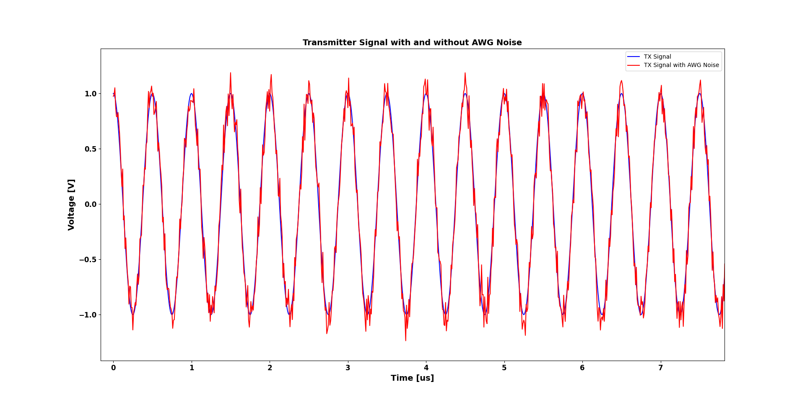
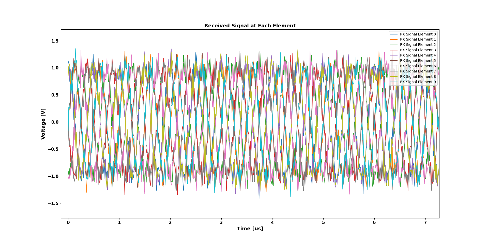
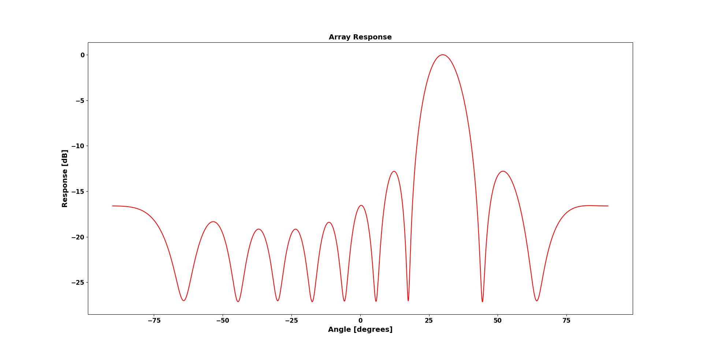
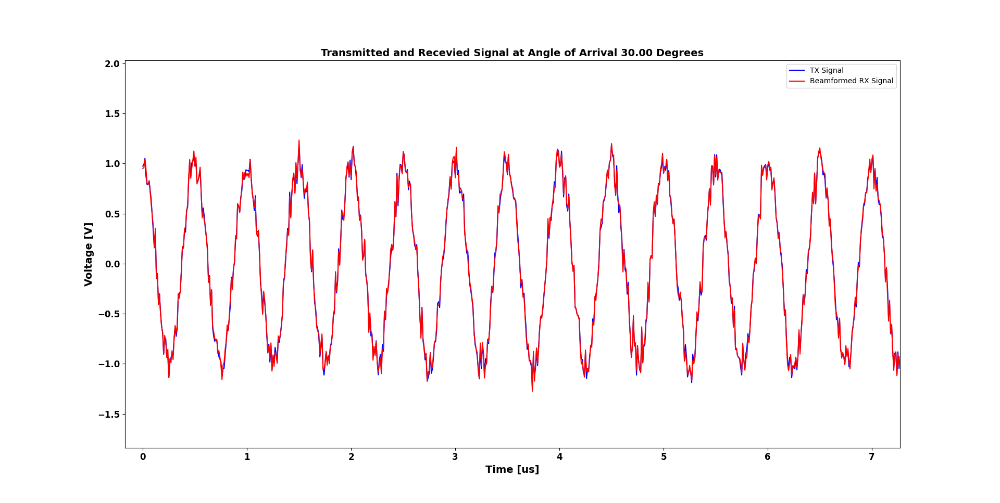

# Delay-and-Sum-Beamforming-Algorithm
Delay-and-Sum-Beamforming-Algorithm for 10 elements Ultrasound Uniform Linear Array (ULA) 

This repository contains the implementation of a Delay-and-Sum (DAS) Beamforming algorithm for an ultrasound linear array transducer with 10 elements. The algorithm is designed to estimate the direction of arrival (DOA) of signals impinging on the sensor array and to enhance the signal from a specific direction while suppressing noise and interference from other directions. The code is written in Python and utilizes the NumPy and Matplotlib libraries.

## Array Response Animation

<div align="center">
  
</div>

## Introduction
Beamforming is a signal processing technique used to focus the reception of signals from a specific direction. In this algorithm, we employ a Uniform Linear Array (ULA) with a specified number of elements to perform DAS beamforming. The goal is to apply time delays to the received signals, sum them constructively, and determine the angle of arrival that produces the strongest response.

The key steps of the algorithm include:

Generating a transmitted signal with Additive White Gaussian (AWG) noise.
Simulating the received signals at each array element based on the direction of arrival.
Implementing the DAS beamformer to steer the array across multiple angles and determine the angle that maximizes the response.
Visualizing the beamformed signal and the array response to different angles.

## Code Overview

### Dependencies

- Python 3.x
- NumPy
- Matplotlib

### Usage
1. **Generate Transmitted Signal:** The generate_signal function generates a sinusoidal signal at a specified center frequency and sampling rate, with the addition of AWG noise.

```python
time, AWG_noise, transmitter_signal, transmitter_signal_with_noise = generate_signal(sampling_rate=1e8, number_of_samples=10000, center_frequency=2e6)
```

2. **Delay-and-Sum Beamforming:** The delay_and_sum_beamformer function simulates the received signals at each array element, computes the array response to different angles of arrival, and identifies the angle with the highest response. The function also visualizes the received signals, the array response, and the beamformed signal.

```python
delay_and_sum_beamformer(time, AWG_noise, transmitter_signal, transmitter_signal_with_noise)
```

### Main Functions
- **generate_signal**: Generates a sinusoidal transmitted signal with AWG noise.

- **delay_and_sum_beamformer**: Implements the DAS beamforming algorithm, simulates received signals, computes the array response, and visualizes the results.

### Example Execution
To execute the algorithm, run the following code:

```python
if __name__ == "__main__":
    sampling_rate = 1e8
    number_of_samples = 10000
    center_frequency = 2e6
    time, AWG_noise, transmitter_signal, transmitter_signal_with_noise = generate_signal(sampling_rate, number_of_samples, center_frequency)
    delay_and_sum_beamformer(time, AWG_noise, transmitter_signal, transmitter_signal_with_noise)
```

## Results
The results of the beamforming algorithm are stored in the results folder. The following files are included:

## Transmitted Signal with and without AWG Noise


## Received Signals from All Elements


## Array Response to Different Angles of Arrival


## Beamformed Signal



## Future Improvements
Implementing other beamforming algorithms such as Capon or MVDR for comparison.
Extending the simulation to include more realistic scenarios with multiple sources or varying element spacings.
Adding support for different array geometries, such as circular or planar arrays.

## License
This project is licensed under the [MIT License](LICENSE) - see the LICENSE file for details.


## Acknowledgments
The implementation of the DAS beamformer was inspired by various signal processing and array processing techniques commonly used in ultrasound imaging and radar systems.

This README file provides a comprehensive overview of the DAS beamforming algorithm, its implementation, and the results. It serves as a guide for users who want to understand, execute, or extend the code in this repository.
